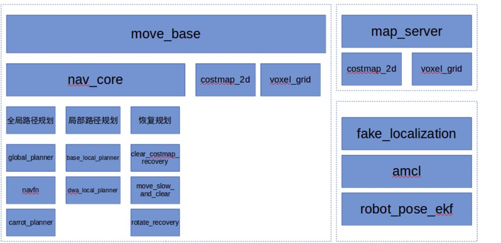
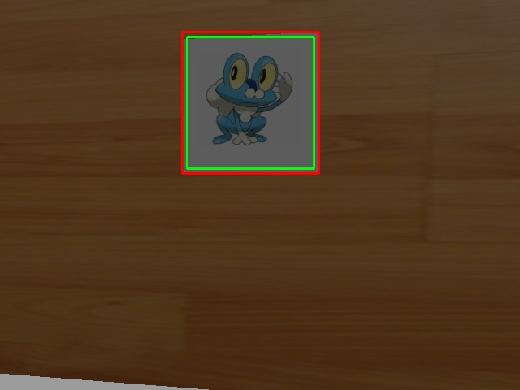
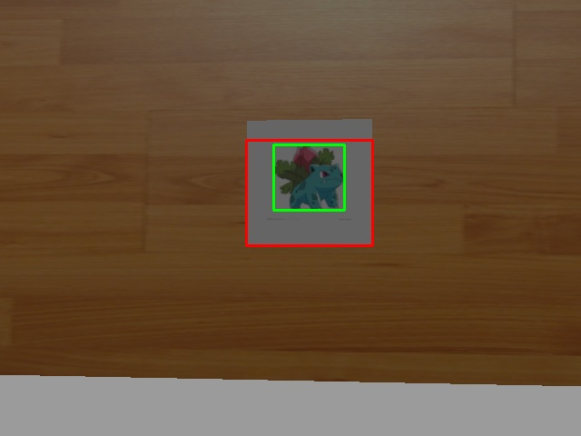
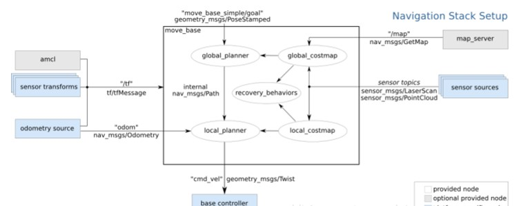
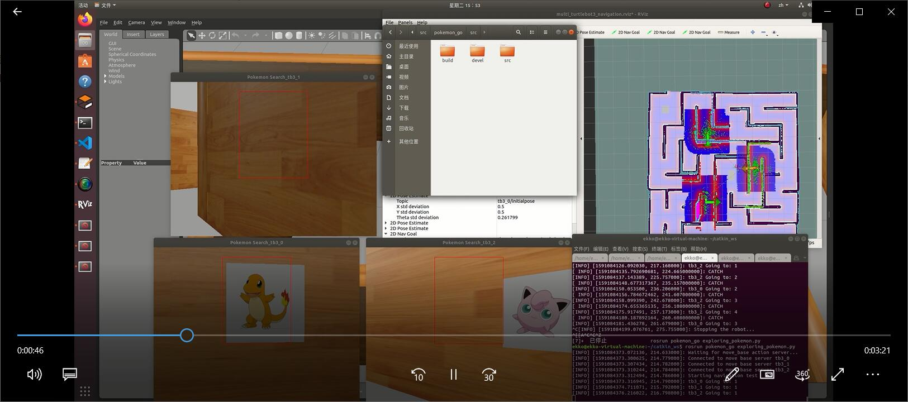
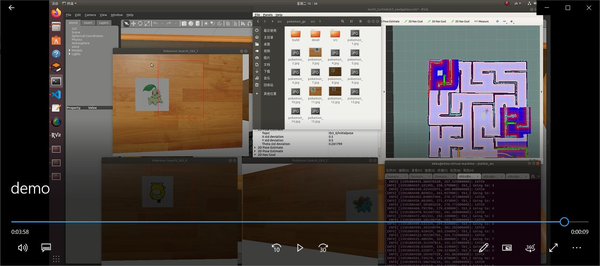

# Pokemon-Go report

小组成员：孟星宇、赵宇、李云帆、赵航

### 贡献与分工

本项目分工为如下几个部分：

- 自动驾驶、建图
- 多机器人协作
- Pokemon识别抓取
- PPT与Report的制作以及答辩

本小组分工如下：

|        | 主要工作            | 工作量占比 |
| ------ | ------------------- | ---------- |
| 孟星宇 | 自动驾驶、建图+PPT  | 25%        |
| 赵宇   | 自动驾驶、建图+报告 | 25%        |
| 李云帆 | 多机器人协作        | 25%        |
| 赵航   | Pokemon识别抓取     | 25%        |

### 实验环境

- 操作系统：Ubuntu18.04
- Ros版本：ROS-melodic
- 其他：c++=std11, python2-v=python2.7, python3-v=python3.6,Gazebo=9

### 建图、导航

建图部分没有使用机器人自动建图，而是先把图建好，这是ROS[1]提供的路径规划的解决方案：

通过提前建图与路径规划，机器人会找到Pokemon的位置。

### Pokemon识别抓取

- 我们使用OpenCV[2]的接口去完成本部分工作，OpenCV是一个基于BSD许可（开源）发行的跨平台计算机视觉库，可以运行在Linux、Windows、Android和Mac OS操作系统上。它轻量级而且高效——由一系列 C 函数和少量 C++ 类构成，同时提供了Python、Ruby、MATLAB等语言的接口，实现了图像处理和计算机视觉方面的很多通用算法。

- 识别结果：

  

  

### 多机器人协作

原理/结构如图

### 实验结果

如result_demo/demo.mkv中展示，我们的机器人在三分钟内抓到了15个Pokemon

- 最初，保存Pokemon的文件夹清空
- 经过三分钟后，找到15个Pokemon

### 实验结论

通过理论分析与实际验证，我们的路径规划、识别算法以及多机器人协作的Pokemon抓取方法是可行的。

抓取效率为三分钟15个Pokemon，达到实验设计目标。

### 不足与改进

1. 不足

   并没有自动建图，而是使用提前建好图的方式。

2. 考虑可能的改进

   - 未来如果继续完善这个项目，将使用自动建图的方式去建图
   - 同时多机器人协作策略可以考虑使用智能体控制决策，可以使用PPO[3]之类的算法对多智能体进行训练，如果地图会产生变化，或者地图的信息是非完全的，还可以在模型上加入一层LSTM去处理这种非完全信息的情况，使智能体不止能在固定的图上使用，而是可以在图上元素变化的时候也可以控制机器人移动、搜寻Pokemon。

### 引用

[1] ROS, "http://wiki.ros.org/"

[2] OpenCV, "https://github.com/opencv/opencv"

[3] J. Schulman, F. Wolski, P. Dhariwal, A. Radford, and O. Klimov, “Proximal
policy optimization algorithms. arxiv 2017,” arXiv preprint arXiv:1707.06347.